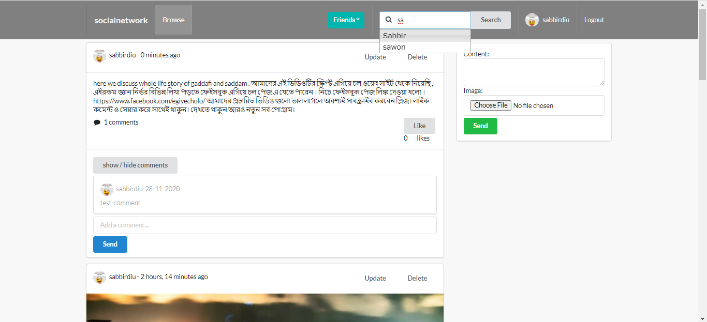
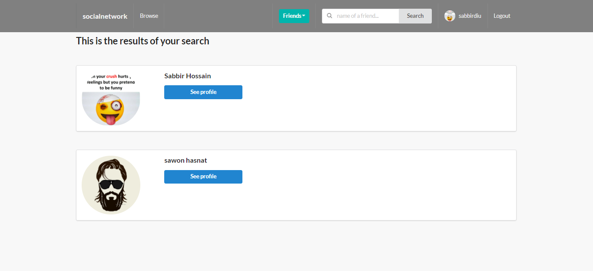
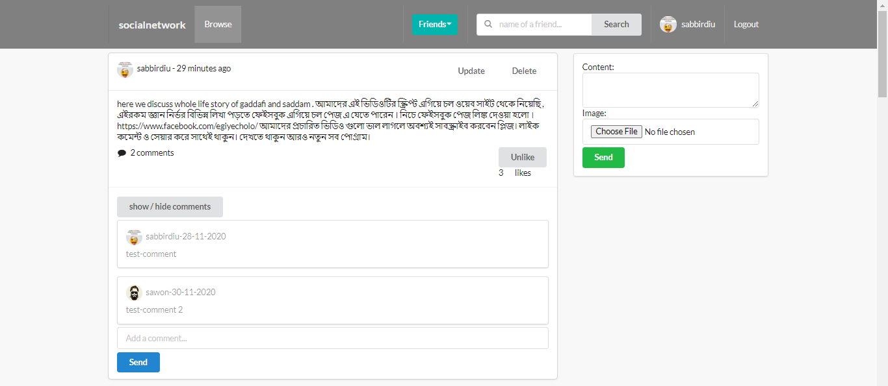
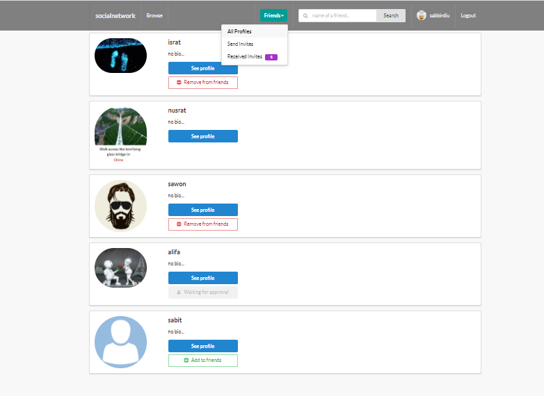
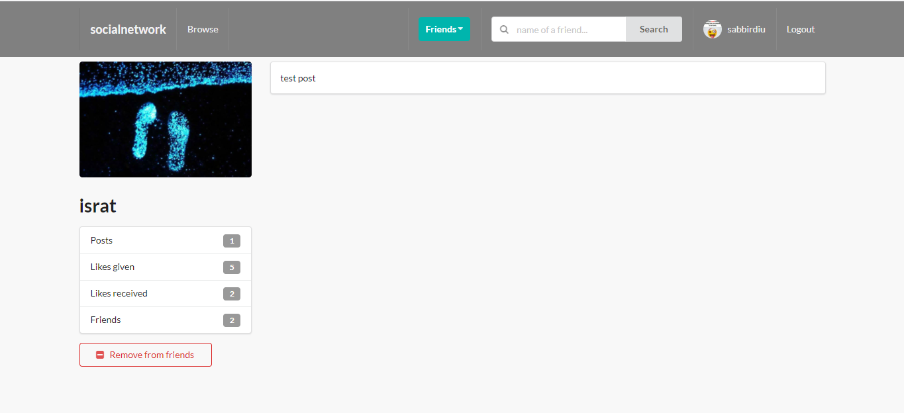
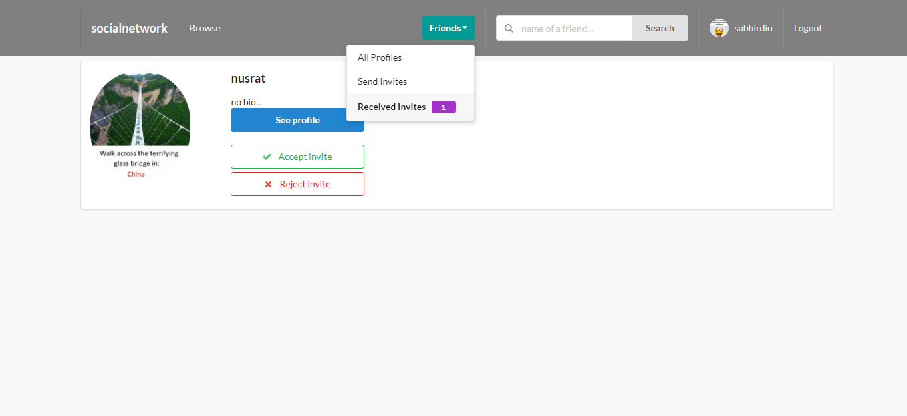
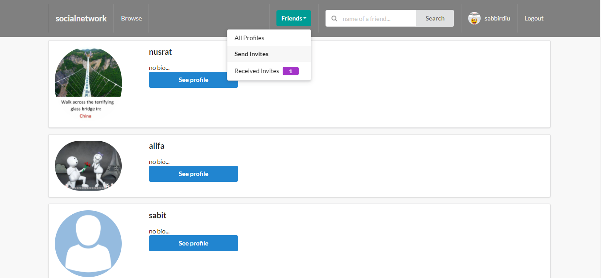
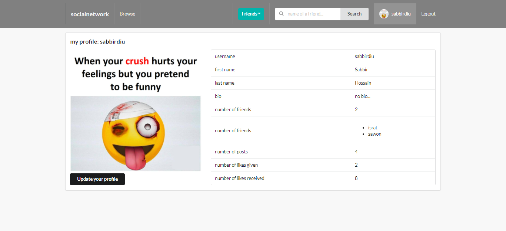

# Django_Social_Network

Used Tech Stack

1. Django
2. Sqlite 
3. Semantic UI

### Screenshots of the project page

## Auto Search page

##  Search Result

## Home page

## All User Profile page

## Profile Details page

## Recieved Invites page

## Friend request send page

## User Profile page

## User Profile Update page
