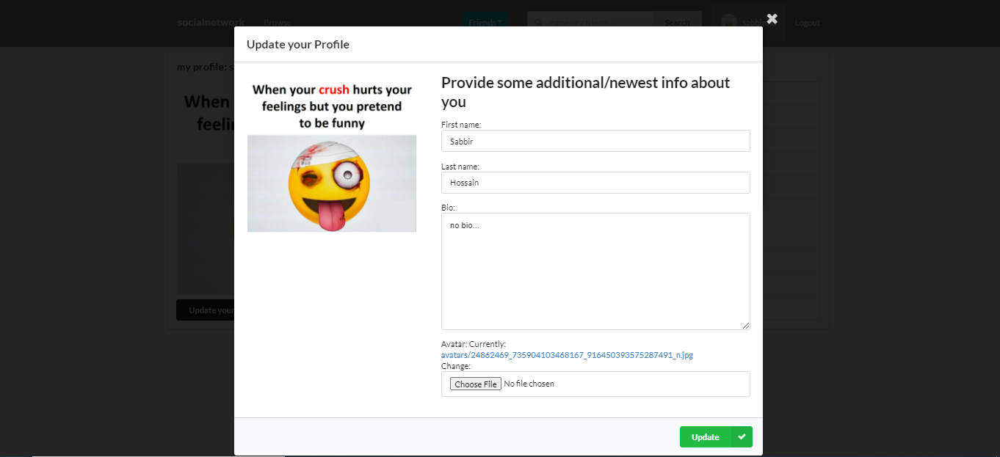

# Django_Social_Network

Used Tech Stack

1. Django
2. Sqlite 
3. Semantic UI

### Screenshots of the project page

## Auto Search page

##  Search Result

## Home page

## All User Profile page

## Profile Details page

## Recieved Invites page

## Friend request send page

## User Profile page

## User Profile Update page

### Local environment

#### Install

1. Create a virtual environment

    `virtualenv venv`

    Or

    `python3.8 -m venv venv`

2. Activate it

    `source venv/bin/activate`

3. Clone the repository and install the packages in the virtual env:

    `pip install -r requirements.txt`

4. Add `.env` file.

    `cp .env.dev.sample .env`

5. Add Github client ID and client secret in the `.env` file

#### Run

1.With the venv activate it, execute:

    python manage.py collectstatic

*Note* : Collect static is not necessary when debug is True (in dev mode)

2. Create initial database:

    `python manage.py migrate`

3. Load demo data (optional):

    `python manage.py loaddata fixtures/app_name_initial_data.json --app app.model_name`

4. Run server:

    `python manage.py runserver`

#### Run test:
``python manage.py test``

#### To dump data:
``python manage.py dumpdata --format=json --indent 4 app_name > app_name/fixtures/app_name_initial_data.json``

Show your support by 🌟 the project!!
